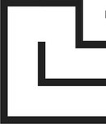
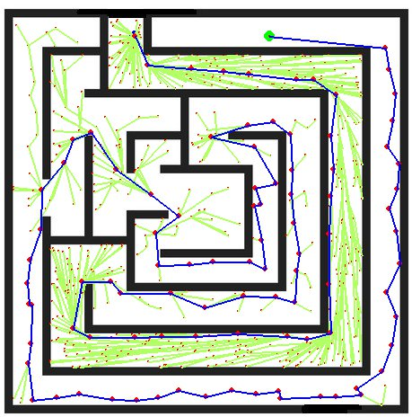
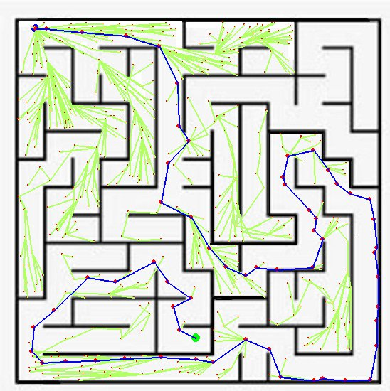
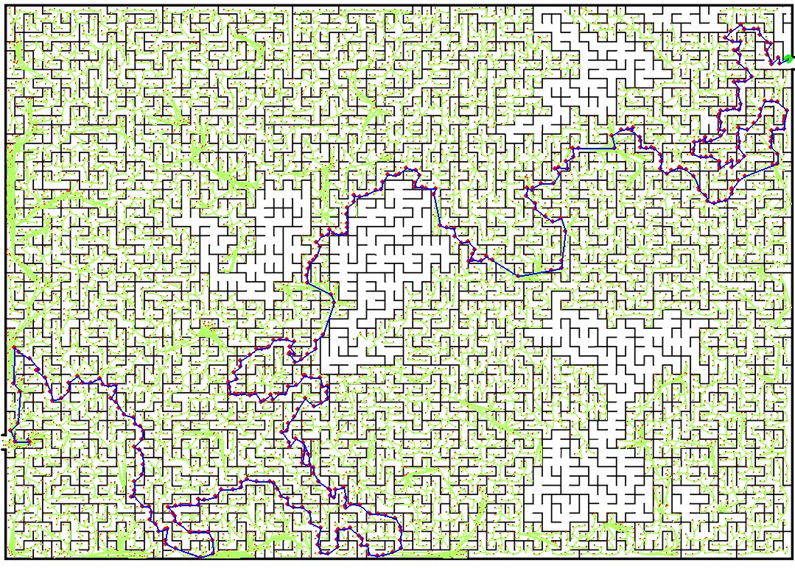

# Fast 2D Path Planning for Complex Indoor Map Based on RRT

## People involved in the project

**Student**

Nguyen Viet Tung

**Supervisor**

Dr. Pham Xuan Tung - https://usth.edu.vn/en/dr-pham-xuan-tung-5043/

This project is the thesis for my Bachelor degree where I studied at [University of Science and Technology of Hanoi](https://usth.edu.vn/en).

All the codes are originally made except for the file ```reeds-shepp.py``` and its utility function ```utils.py``` which are used for finding the Reeds-Shepp path and can be found at [this link](https://github.com/nathanlct/reeds-shepp-curves).

***Important Notice: The paper for this project has also been published in a conference. If you want more details, check it out at [this link](https://link.springer.com/chapter/10.1007/978-981-95-0144-1_48).***

## Description
Sampling-based algorithm RRT (Rapidly exploring Random Tree) is widely adopted due to its simplicity as well as efficient in find path between two points. However, it is not without some shortcomings; One of the problem that RRT-based algorithms face is that it is not very efficient in environment with high level of complexity due to it sampling procedure. Therefore, this project aim to develop some sampling procedure in order to guide the sampling tree to navigate complex environments (e.g mazes,...).

After developing the algorithm, it will be tested with the basic RRT algorithm taken from ... to compare how much the find time have improve. Although being a big part of any sampling-based path planning algorithm, this project won't discuss the collision detection algorithm. The base RRT and our RRT with the new sampling procedure will be using the same collision checking algorithm, therefore, the objectivity is preserves.


## Assumption
1. We are working in the free configuration directly, which means our car is a point without any dimesions.

2. For conveniences in experimenting, the map will be in the form of binary occupancy bitmap. Each cell of the map corresponds with a pixel of the images use as the base for the map.


## Methodology

First, we indentified the problem that RRT-based algorithm faces when dealing with complex map is that the rate of success full connection are relatively low. One of the most common problem leading to this situations is trying to sample through tight corridoor or tight space in general.

<div style="text-align: center;">  
    
  <figcaption>Example of space where basic RRT struggle</figcaption>
</div>  


In order to guide the sampling tree, instead of random sampling, we divide the map into cell of predetermined dimiension so we can control which space (which cells) need more sample and which doesn't. In the code specifially, we employed a seperated algorithm that work in combination with the base RRT. Our alogorithm will try to generate node in an empty cell (cell without any node) that has one of its adjacent cell (either horizontally, vertically or diagonally) being non-empty. Note that the dimension of the cell can hange dynamically depends on how many consecutive iteration of the algorithm fail to generate a node (may be due to cell being to big).

This algorithm works especially well with the base RRT since, intuitively speaking, the fewer empty cells there are, the better the chance of a node being successfully connect to some other node during the basic RRT algorithm.

## Experimental results

We test the algorithm on three map and get the result as following. Note that the RRT* and RRT have the same step size, collision-checking algorithm, nearest neighbors search algorithm and are being run on the same hardware.

For the first map, the search time for thr RRT* algorithm is only about 2 seconds while the basic RRT takes 160 seconds without any optimization during its operation.

<div style="text-align: center;">  
    
  <figcaption>RRT* result for the first map</figcaption>
</div>  

For the first map, the search time for thr RRT* algorithm is only about 1 seconds while the basic RRT takes 95 seconds without any optimization during its operation.

<div style="text-align: center;">  
    
  <figcaption>RRT* result for the second map</figcaption>
</div>  

For the third map, the search time is about 600 second. Because of the difficulty of this map, we won't be testing with the base RRT algorithm.

<div style="text-align: center;">  
    
  <figcaption>RRT* result for the third map</figcaption>
</div>  

## How to run the algorithm

To test out the algorithm yourself, git clone the directory and install the ```pygame``` package 

To test the RRT* algorithm, change the start, goal position as well as the map similar to what is being done in the file ```RRT_star.py``` and run the python file.

To compare it with the base RRT algorithm, do similarly to the RRT* algorithm but with the file ```RRT.py```.

You can set the parameter ```find_rs_path = True``` for the algorithm to find the Reeds-Shepp path afterward. The turning radius is being set to 25 for the algorithm.


If you want to test with your own map, just enter the path to the image as one of the parameter for the function. Make sure that the path is of one of the basic format (jpg, jpeg png, ...) and should be in black and white (obstacles - black and free space - white)
